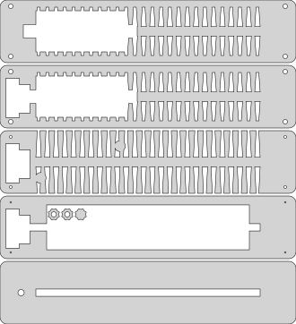

# Light sheet holder 
A nice stand for your engraved acrylic. It houses the LEDs, a dimmer and a power supply. Has holes on the side gives for a nice lighting effect and for ventilation so the LEDs won't overheat. It's all parametric so you can modify it to your hearts desire. 
The rendered design you see here, calls for a 250mm wide and 8mm thick acrylic. The used acrylic was pre-frosted in a pattern of tiny hexagons because it came out of an old LCD monitor but later i might redo the engraving on a piece of clear acrylic to get better contrast in the final engraved image. 

Enjoy.

